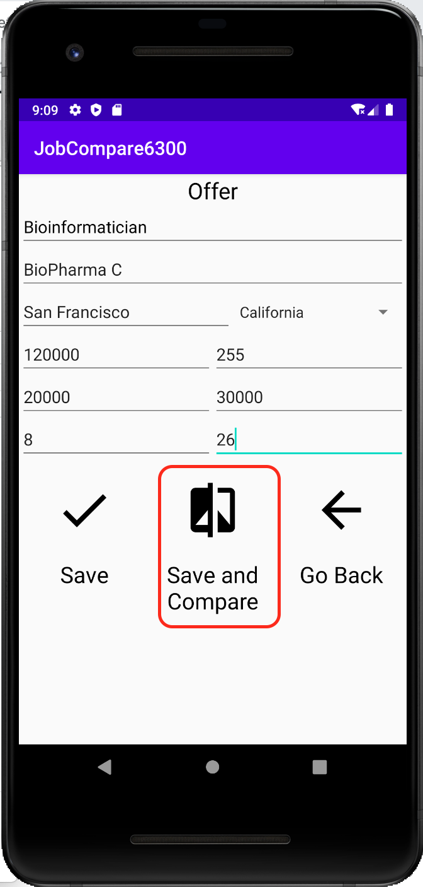
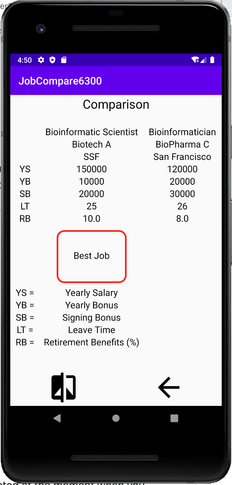
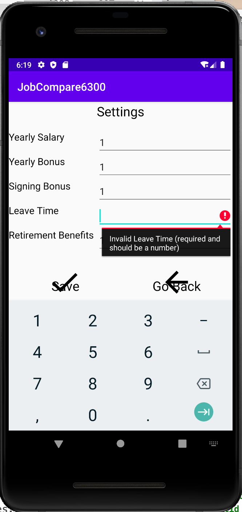

# UserManual

**version1.2**

**Author**:

## TEAM 62 

|Name	|Gatech ID|Gatech email|
|---	|---	|---	|
|Hyun Yong Jin|hjin85|hjin85@gatech.edu|
|Stephen Sanchez|ssanchez42|ssanchez42@gatech.edu|
|Vineeth Karayil Sekharan|vsekharan3|vsekharan3@gatech.edu|
|Benjamin Hurtado Meza|bhm6|benja.hur@gatech.edu|

 

## Overview
This is a single-user job offer comparison app that ranks user's current job and offered jobs based on parameters such as yearly salary, singing bonus, yearly bonus, retirement benefits, leave time and cost of living. User may also customize ranking algorithm by setting up weights of yearly salary, signing bonus, yearly bonus, retirement benefits and leave time. The app displays and compares the jobs ranked from best to worst, and user is able to pick up two jobs to compare side-by-side.

## 1 Main Menu

Main page displayed when the app is started. From this main menu, you may access to four options: Job, Offers, Compare, Settings.

---

## 2 Job

Click on Job icon from Main Menu to enter Job.

---

Job page.  

---

  
  
  

Please enter current job information:
>- Title
>- Company
>- City and State
>- Yearly Salary
>- CLI (Cost of living index)
>- Yearly Bonus
>- Signing Bonus
>- Retirement Benefits (as percentage matched)
>- Leave Time (as number of days)

Select the state from drop down menu.
No missing values are allowed. When there are missing values, there will be a pop-up message showing what is missing and what format is required to put.

---

Press 'Save' icon to store current job and return to Main Menu.

---

Press 'Go Back' icon to return to main menu without saving it.

---

In a scenario when you restart the app and enter into Job, the saved current job information persists and displayed in Job page.

---

## 3 Offers

Click on Offers icon from Main Menu to enter new job offers.

---

  
  
  

Offers page.
Please enter new job offers as same format as current job described above.
No missing values are allowed. When there are missing values, there will be a pop-up message showing what is missing and what format is required to put.

---

Press 'Save' icon to save current offer and return to main page. You may repeat this to save multiple offers.

---

  
  

Press 'Save and Compare' icon to save current offer and directly jump to compare page. This will directly bring you to the compare page, where the current job and entered offer is displayed side-by-side.

---

Press 'Go Back' icon to return to main menu without saving current offer.

---

## 4 Compare

Click on Compare icon from Main Menu to see the list of stored jobs.

---

This page displays all jobs stored in app. Current job is clearly highlighted with a 'person icon' and displayed on the top. Other jobs were sorted based on rank from the best to worst.

---

You can select two jobs to compare by clicking on them. The selected jobs were highlighted with green. You may unselect jobs by clicking on the selected jobs. The app allows to select maximum two jobs, not any more.

---

  
  
  

After selecting two jobs, click on "Compare Icon" to compare selected jobs side-by-side in the next page. In the page, the best job based on ranking algorithm is indicated. When less than two jobs were selected at the moment when you click on "Compare Icon", the app will generate a pop-up message indicating selecting two jobs is required.

---

  
  

Click on "Compare Icon" to return to previous page where you can select two jobs to compare. Previous selections are not saved when returned.

---

  
  

You may directly return to main menu by pressing 'Go Back' icon from any pages from downstream of compare pages.

## 5 Settings

Click on Settings icon from Main Menu to enter compare settings.

---

Settings page. Default value(1) for each criteria has been set.

---

  
  

Please enter user-defined comparison settings (optional). The weights defined here is used to calculate the ranking of your jobs. Please put zero or positive integers only. Negative values or decimal points are not allowed and you will not able to enter such a value. Higher number indicates more important criteria.  

>- Yearly Salary
>- Yearly Bonus
>- Signing Bonus
>- Leave Time
>- Retirement Benefits

No missing values are allowed. When there are missing values, there will be a pop-up message showing what is missing and what format is required to put.

---

Press check icon to store current settings. This new setting persists unless you update new values.

---

Press go back icon to return to main menu.

---

This is it! Please enjoy Team62's Job Offer Comparison App!
